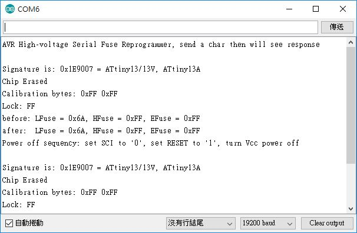

# Tiny13_HV_resetter
Attiny13, reset fuse and the chip, uses High Voltage Serial programming mode

2018-MAR-07

schematic & physical connection


reset and done  


source code  
https://github.com/xiaolaba/Tiny13_HV_resetter/blob/master/Tiny13_HV_resetter.ino

hex files  
https://github.com/xiaolaba/Tiny13_HV_resetter/blob/master/Tiny13_HV_resetter.ino.hex   
https://github.com/xiaolaba/Tiny13_HV_resetter/blob/master/Tiny13_HV_resetter.ino.with_bootloader.hex    

To embeds image to this read.me
.  
.  
.  
.  
.  
.  
.   
2020-JUN-08 update

```

procedure

進入 高壓 PROGRAMMER 燒寫的方法

1) SDI, SII, SDO, RESET, VCC 接地
2) VCC 接到 4.5V - 5.5V, 保證 VCC 在20us 內超過 1.8V
3) 等待 20 - 60us, 然後 RESET 接 12V +/-0.5V) (最少 100ns)
4) 維持以上狀態最少 10us (此時應該已經進入了高壓模式)
5) 斷開 SDO 的接地, 避免搶奪, 短路
6) 等待最少 300us, 然後才操作 SDI 和 SII 對 ATTINY13 讀寫
7) 斷電離開或 RESET 接地便可脫離高壓模式


code


    pinMode(SDO, OUTPUT);     // Set SDO to output
    digitalWrite(SDI, LOW);
    digitalWrite(SII, LOW);
    digitalWrite(SDO, LOW);
    digitalWrite(RST, HIGH);  // 12v Off
    digitalWrite(VCC, HIGH);  // Vcc On
    delayMicroseconds(60);    // wait 20-60us
    digitalWrite(RST, LOW);   // 12v On
    delayMicroseconds(10);    // keep the state for at least 10us
                              // should be entered HV Programming mode
    pinMode(SDO, INPUT);      // Set SDO to input, relase
    delayMicroseconds(300);   // wait for 300us before giving instruction to SDI/SII
```
.
.
.  
Atmel Data sheet of how to,  
  
  
Atmel Data sheet of how to,  
  
  
chip, no ISP capable before the fuse rest.  
  
